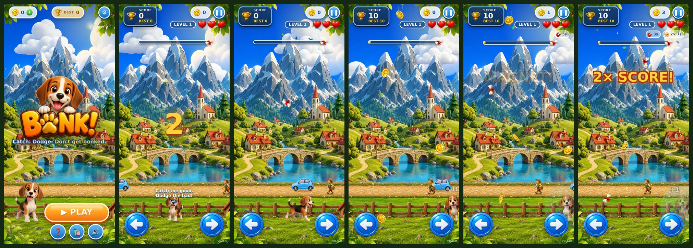

# 🐾 BONK! — Catch. Dodge. Don't get bonked.

A polished 2D catch-and-dodge mobile web game with a Pixar-style parallax world.
Move the puppy left/right, catch bones and coins, grab power-ups, and dodge falling rocks and bombs.

**Version:** 0.10.0 · **Stack:** vanilla HTML5 Canvas + JS + CSS (no build step, no dependencies)



---

## 🚀 Quick start

```bash
# any static server works — e.g.
bash tools/serve.sh            # → http://localhost:8080
# or
python3 -m http.server 8080
```
Open `index.html` through a server (not `file://`) so images and localStorage work.

**Controls**
| Platform | Move | Pause |
|---|---|---|
| Phone | Hold ◀ ▶ buttons **or drag** anywhere on the play area | ❚❚ button |
| Desktop | `←` `→` or `A` `D` | `Esc` / `P` |

---

## 📁 Project structure

```
bonk/
├── index.html                 # single page: all scene markup (menu, level board, HUD, modals) + script order
├── README.md                  # this file
├── .gitignore  .editorconfig
├── styles/                    # CSS, one file per screen (main.css imports them in order)
│   ├── main.css  base.css  menu.css  map.css  hud.css  modals.css
├── src/                       # game code — vanilla JS, no build step, one global per file
│   ├── app.js                 # bootstrap: load assets → register scenes → fixed-step main loop → settings
│   ├── core/                  # engine-level, game-agnostic
│   │   ├── config.js          #   VERSION + all tunables (puppy physics, parallax, FX flags)
│   │   ├── events.js          #   tiny pub/sub (Events.on / emit)
│   │   ├── flags.js           #   feature flags (defaults · ?flag_x=1 · Remote Config later)
│   │   ├── analytics.js       #   event log: ring buffer + sinks, export, summary
│   │   ├── save.js            #   ★ save v2: one versioned document, migrations, backup, corrupt recovery
│   │   ├── wallet.js          #   coins: bounded add/spend, events
│   │   ├── storage.js         #   Store facade: best, per-level {best,cleared,stars,plays}, settings, stats
│   │   ├── assets.js          #   image manifest + loader  → Assets.img('key') / Assets.url('key')
│   │   ├── audio.js           #   procedural SFX + puppy voice (Web Audio) → SFX.play('key')
│   │   └── input.js           #   touch buttons + drag + keyboard → Input.left/right/drag
│   ├── game/                  # gameplay (never touches the DOM except FX overlay)
│   │   ├── items.js           #   ★ ITEM catalogue + POWERS (data only)
│   │   ├── levels.js          #   loads + validates data/levels/*.json into LEVELS
│   │   ├── goals.js           #   ★ GOALS registry — 3rd-star objectives per level
│   │   ├── game.js            #   Game controller: score, lives, powers, combo, near-miss, shield, star evaluation, flow
│   │   ├── ftue.js            #   first-time hints (move / catch / dodge / combo), once per save
│   │   ├── puppy.js           #   Puppy: physics, sheet animation (idle/run/yay/bonk/dizzy), draw
│   │   ├── spawner.js         #   Spawner: item spawning / natural falling / magnet / collisions
│   │   ├── background.js      #   BG: parallax renderer + THEMES + camera framing
│   │   ├── ambient.js         #   background life per level (birds, walkers, cars) — behind the fence
│   │   └── effects.js         #   FX: pop text, banners, flash, shake, particles
│   ├── ui/
│   │   ├── hud.js             #   HUD DOM binding (score, hearts, coins, goal chip, power timers)
│   │   └── modals.js          #   modal open/close + fill (pause, game over, level clear w/ stars, settings)
│   └── scenes/                # glue: user actions ⇄ Game events ⇄ UI
│       ├── menu.js  map.js  play.js     # MenuScene · MapScene (level board) · PlayScene
├── data/
│   └── levels/                # ★ L01.json … + index.json — one file per level
├── assets/                    # everything the game SHIPS (all WebP, ≈4 MB)
│   ├── images/
│   │   ├── bg/                # parallax layers: sky, clouds, mountains, village (+water_mask), meadow, road, foreground_wide, trees
│   │   ├── ambient/           # bird sheet, walker sheets, cars
│   │   ├── puppy/             # sprite sheets cut from AI video: run 16f · idle/yay/bonk/dizzy 24f + still poses
│   │   ├── items/             # one sprite per item key (bone, goldbone, coin, magnet, star, shield, rock, bomb)
│   │   ├── ui/                # board, arrows, hearts, stars, lock, trophy, paw badge
│   │   ├── levels/            # thumb_<id>.webp — level-select thumbnails
│   │   └── brand/             # logo
│   └── audio/                 # reserved for music / recorded SFX (empty)
├── art/                       # SOURCE material, not loaded by the game — see art/README.md
│   ├── reference/             # original mockups + puppy character reference
│   ├── clips/                 # green-screen AI clips (git-ignored, ≈7 MB)
│   └── ui/                    # raw UI sheets
├── docs/
│   ├── HANDOVER.md            # ★ new developer? read this first
│   ├── ARCHITECTURE.md        # layers, frame flow, state, events, persistence, testing hooks
│   ├── ADDING_CONTENT.md      # recipes: level, goal, item, power-up, theme, scene
│   ├── ANIMATION_BRIEF.md     # how to generate new puppy clips + the sheet pipeline
│   ├── STATUS.md              # what is done / what is next (start here)
│   ├── PHASES.md              # 7 execution phases to launch, with done-when lists
│   ├── LEADERBOARD.md         # leaderboard rules: local-first, cache, daily sync windows, bounded queries
│   ├── LAUNCH_PLAN.md         # launch scope: screens, shop, ads, Firebase, Android
│   ├── PHASE2_PLAN.md         # locked long-term design roadmap (M1–M5, monetization principles)
│   ├── CHANGELOG.md
│   └── screenshots/           # current screenshots (regenerated by tools/check.py)
└── tools/
    ├── check.py               # ★ smoke test: syntax, asset refs, version tags, headless play, screenshots
    ├── serve.sh               # local dev server
    ├── optimize_assets.py     # PNG/JPG → WebP for new art
    ├── build_puppy_sheets.py  # cut sprite sheets from art/clips/*.mp4 (needs opencv, numpy, Pillow)
    ├── clip_utils.py          #   helpers for the above
    └── grade_puppy.py         # ONE-SHOT colour grade (already applied — only for freshly rebuilt sheets)
```

★ = **data files**. Most future content (new levels, items, power-ups) only touches these.

---

## ➕ Adding content (cheat-sheet)

| I want to… | Edit | Details |
|---|---|---|
| Add a level | `data/levels/L0N.json` + `index.json` | copy the last file, edit, register — the board lays itself out; `tools/check.py` validates |
| Add a goal type (3rd star) | `src/game/goals.js` | add an entry to `GOALS` — see `docs/ADDING_CONTENT.md` |
| Add a falling item | `src/game/items.js` + sprite in `assets/images/items/` + line in `src/core/assets.js` | see `docs/ADDING_CONTENT.md` |
| Add a power-up | `items.js` (`POWERS`) + handle in `game.js` / `spawner.js` | |
| Change puppy speed / size | `src/core/config.js` → `PUPPY` | |
| Add a sound | `src/core/audio.js` | reference by key from an item |
| Add a background theme | `src/game/background.js` → `THEMES` | set `theme:` on a level |
| Tune background life (cars/people/birds) | `src/game/ambient.js` → `CFG` | spawn intervals, caps, road position |
| Add a screen (shop, level select) | new `src/scenes/*.js` + `.scene` div in `index.html` + register in `src/app.js` | |

Full recipes with code: **[docs/ADDING_CONTENT.md](docs/ADDING_CONTENT.md)**

---

## 🎮 Gameplay rules

| Item | Effect |
|---|---|
| 🦴 Bone | +10 score (×2 during star) |
| 🪙 Coin | +1 coin (persisted) |
| 🧲 Magnet | 6 s — pulls bones & coins toward the puppy |
| ⭐ Star | 8 s — 2× score |
| 🦴✨ Gold bone | +50 (rare, sparkles) |
| 🛡 Shield biscuit | absorbs the next hit — no heart lost, combo kept |
| 🪨 Rock | **BONK!** −1 ❤, short stun |
| 💣 Bomb | **DIZZY!** −1 ❤, longer stun |

3 hearts per level · 1.6 s invincibility after a hit · clear a level by reaching its `target` score · "Keep playing" carries score/coins forward and restores 1 heart.

**Combo:** every catch (bone, gold bone, coin, power-up) adds a paw to the chain; 4 paws = next multiplier, up to **×5** on bone score. Getting hit or letting a bone touch the ground breaks it.
**Near-miss:** a rock/bomb that just brushes past = "PHEW!" +1 coin.

**Stars per level:** ⭐ reach the target · ⭐ don't lose a heart · ⭐ level-specific goal (`src/game/goals.js`). Stars are sticky and saved per level; the level board and PLAY button use them.

---

## 🧭 Where we are / what's next
0. **[docs/HANDOVER.md](docs/HANDOVER.md)** — new developer orientation (15 min)
1. **[docs/STATUS.md](docs/STATUS.md)** — done vs. next (start here)
2. **[docs/PHASES.md](docs/PHASES.md)** — 7 execution phases to launch, each with a done-when checklist
3. **[docs/LAUNCH_PLAN.md](docs/LAUNCH_PLAN.md)** — launch scope: all screens, shop/skins/remove-ads/subscription, ads rules, Firebase backend, Android wrap
4. **[docs/PHASE2_PLAN.md](docs/PHASE2_PLAN.md)** — locked long-term design (M1–M5) and monetization principles

## ✅ Before you commit
```bash
python3 tools/check.py
```
Checks JS syntax, every asset reference, level JSON files, `?v=` cache tags vs `CONFIG.VERSION`, then plays the game headless on 3 viewports asserting zero console errors, refreshes `docs/screenshots/`, and exercises the data layer (save migration, corrupt-save recovery, wallet bounds, analytics events, reset, flags). Needs `pip install playwright && python3 -m playwright install chromium` for the browser part (skipped gracefully otherwise).

**Release checklist:** bump `VERSION` in `src/core/config.js` → same value in every `?v=` in `index.html`, in the `@import`s of `styles/main.css` and in this README → add a `docs/CHANGELOG.md` entry → `python3 tools/check.py` green.

## 📜 Changelog
See **[docs/CHANGELOG.md](docs/CHANGELOG.md)**.

---

## 📱 Packaging for app stores (later)
The game is a static site — wrap it with [Capacitor](https://capacitorjs.com/) (Android/iOS) or publish as a PWA. No code changes required; add a `manifest.json` + service worker for PWA install.

## License
Art assets were generated for this project. Code © 2026 — all rights reserved (update as needed).
